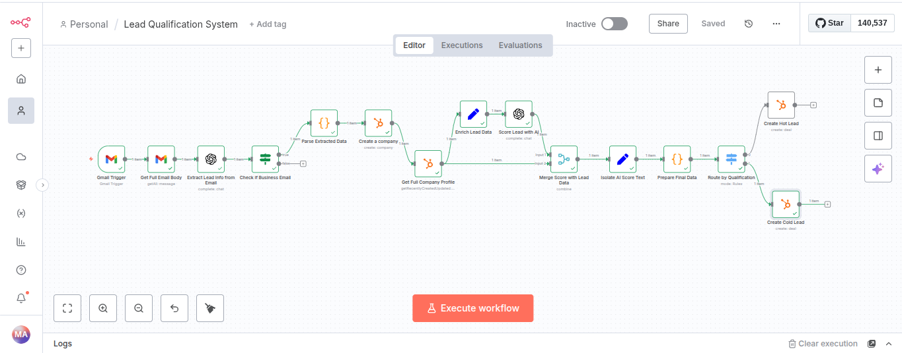

# Hubspot-Lead-Qualification-n8n

This project is a powerful, fully automated workflow that captures new leads from emails, uses AI to extract and enrich data, scores the lead's potential, and creates a deal in the HubSpot CRM, routing it to the correct pipeline based on its qualification.

## Key Features
*   **Automated Email Parsing:** Triggers automatically when a new lead email arrives.
*   **AI-Powered Data Extraction:** Uses OpenAI (GPT-4o) to intelligently read unstructured emails and extract key information like company name, contact details, and inquiry specifics.
*   **Data Enrichment:** Creates a company record in HubSpot to leverage its data enrichment capabilities.
*   **Intelligent Lead Scoring:** A second AI agent analyzes the enriched company and contact data against a custom scoring model to determine if a lead is "hot" or "cold".
*   **Dynamic Routing:** Automatically routes leads into different process flows based on their AI-generated score.
*   **CRM Integration:** Creates a new deal in the appropriate HubSpot sales pipeline, assigning it to the correct stage and associating it with the right contact and company.

## Tech Stack
*   **Automation:** n8n
*   **Artificial Intelligence:** OpenAI API (GPT-4o)
*   **CRM:** HubSpot
*   **Trigger:** Gmail

## Workflow Diagram

 

## How It Works

The workflow follows a logical, step-by-step process to transform a raw email into an actionable sales opportunity:

1.  **Capture:** The **Gmail Trigger** node starts the workflow when an email with a specific label (e.g., "New Lead") is received.
2.  **Extract:** An **OpenAI** node reads the email body and extracts the company name and other initial details into a structured JSON format.
3.  **Filter:** An **If** node checks if a valid company name was found. If not (e.g., it's a personal email), the workflow stops.
4.  **Create & Enrich:** A **HubSpot** node creates a new company record, allowing HubSpot to begin enriching it with its own data.
5.  **Fetch Full Profile:** Another **HubSpot** node fetches the full, enriched company profile.
6.  **Score:** A second **OpenAI** node receives this rich company data, analyzes it against a detailed scoring rubric, and returns a score and qualification ("hot" or "cold").
7.  **Process & Merge:** The workflow merges the AI's score with the company data, parses the response, and prepares a final, clean data object.
8.  **Route:** A **Switch** node directs the lead to the appropriate path based on its "hot" or "cold" qualification.
9.  **Action:** A final **HubSpot** node creates a **Deal** in the sales pipeline, placing it in the correct stage ("Appointment Scheduled" for hot leads, "Qualified to Buy" for cold leads) and associating it with the company.

