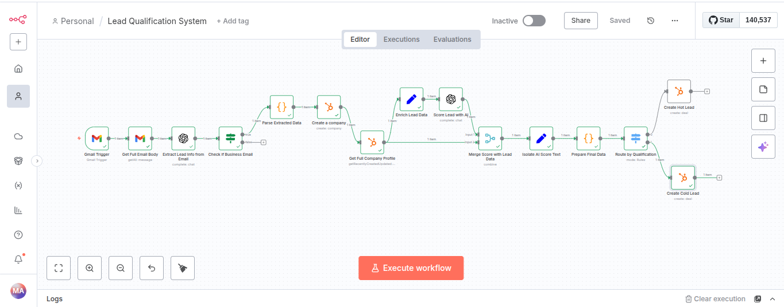

# 📈 HubSpot CRM Lead Automation: AI-Powered Qualification System 🚀

---

## 🚀 The Solution: Autonomous B2B Lead Qualification
In high-volume B2B sales, speed and quality are everything. This project is an **Enterprise-Grade AI Lead Pipeline** that transforms unstructured inbound emails into enriched, qualified, and scored HubSpot deals. 

The system acts as a **Virtual Sales Development Representative (SDR)**: it monitors Gmail for new inquiries, uses **OpenAI GPT-4o** to extract company data, triggers HubSpot's native enrichment engine, and applies a qualitative AI scoring rubric to categorize leads. This ensures your sales team ignores the "noise" and focuses 100% of their energy on high-value "Hot" opportunities. 🤖📊✨

---

## 📊 Business Impact & Sales Outcomes
This automation is engineered to maximize ROI by optimizing the top-of-funnel workflow:

*   **⚡ Zero Lead Decay:** Processes and categorizes inbound inquiries in under 30 seconds, ensuring instant follow-up capability.
*   **📉 90% Manual Entry Reduction:** Automatically creates Contacts, Companies, and Deals, perfectly associated within the HubSpot ecosystem.
*   **🎯 AI-Powered Qualification:** Moves beyond simple form fields by using GPT-4o to analyze the *intent* and *fit* of a lead based on real-time enriched company data.
*   **🛣️ Dynamic Pipeline Routing:** Automatically routes "Hot" leads to the high-priority "Appointment Scheduled" stage while sending "Cold" leads to long-term nurturing.

---

## ✅ Problems Solved
- **🛑 Lead Fatigue:** Prevents sales reps from being overwhelmed by unqualified or low-quality inquiries. 📧
- **🛑 Incomplete CRM Records:** Uses an "Enrichment Loop" to ensure every HubSpot Company record is populated with industry, revenue, and location data. 🎯
- **🛑 Manual Research Bottleneck:** AI handles the initial vetting process, eliminating the need for reps to spend hours on LinkedIn or company websites. 🔍
- **🛑 Disorganized Pipelines:** Ensures every lead is correctly mapped to a Deal, Contact, and Company ID, maintaining a 100% clean CRM. 📂

---

## 🖼️ System Architecture

### Workflow Orchestration (HubSpot AI Lead Pipeline)
The master blueprint of the automation logic—from Gmail ingestion to dual-stage AI analysis and HubSpot routing.

  

---

## 🧠 Core Technical Pillars

### 1. 📥 Intelligent Ingress & Data Extraction (Gmail + AI)
The process begins with a **Gmail Trigger**. Raw email text is passed to **GPT-4o**, which acts as a "Data Secretary." It extracts the `Company Name`, `Contact Person`, and `Specific Inquiry` from unstructured text, converting it into a clean JSON object for the CRM.

### 2. 🔄 The HubSpot Enrichment Loop
This stage leverages HubSpot’s powerful backend:
- **Record Creation:** The workflow creates a Company and Contact.
- **Enrichment Trigger:** By programmatically adding the website domain, HubSpot’s native engine fetches company revenue, size, and industry.
- **Data Refresh:** A momentary delay followed by a "Get Record" node ensures the workflow has the *enriched* data before scoring. 🏗️✨

### 3. ⚖️ Qualitative AI Lead Scoring (The Rubric)
A second AI node receives the **full enriched profile**. It compares this data against a predefined business rubric (e.g., *"Is this a Tech company with >$1M revenue?"*). The AI then returns a temperature score: **HOT** or **COLD**. 🧠🔍

### 4. 🛣️ Automated Deal Routing (Logic Switch)
A dynamic **Switch Node** reads the AI score to determine the Deal's fate:
- **HOT Path:** Creates a Deal in the **"Appointment Scheduled"** stage and triggers an internal notification for the sales team.
- **COLD Path:** Creates a Deal in the **"Qualified to Buy"** (Nurture) stage, ensuring the lead isn't lost but stays out of the priority view. 📡🚀

---

## ✨ Advanced Technical Features
- **⚙️ Association Logic:** Programmatically links the Contact ID to the Company ID and the Deal ID, ensuring a 360-degree view in HubSpot.
- **🛡️ Quality Gatekeeping:** Implemented an "If Node" that terminates the workflow if the AI fails to identify a legitimate business name, keeping your CRM free of spam.
- **⏳ Production-Grade Scalability:** Built to handle hundreds of concurrent inbound emails without losing data or creating duplicate records.

---

## 🛠️ Technical Stack
| Layer | Technology |
| :--- | :--- |
| **🔄 Automation** | **n8n** (State Management & Orchestration) |
| **🧠 AI Brain** | **OpenAI GPT-4o** (Data Extraction & Lead Scoring) |
| **📊 CRM Hub** | **HubSpot API** (Lead Management & Data Enrichment) |
| **📩 Inbound** | **Gmail API** (Real-time Lead Ingress) |
| **📜 Scripting** | **JSON / JavaScript** (Data Mapping & Formatting) |

---

## ✍️ Author
**Muneeb Ali Khan**
- **GitHub:** [@Muneeb20019](https://github.com/Muneeb20019)
- **LinkedIn:** [Muneeb Ali Khan](https://www.linkedin.com/in/muneeb-ali-khan-2a1675365)

---

## 📜 License
This project is licensed under the MIT License.
